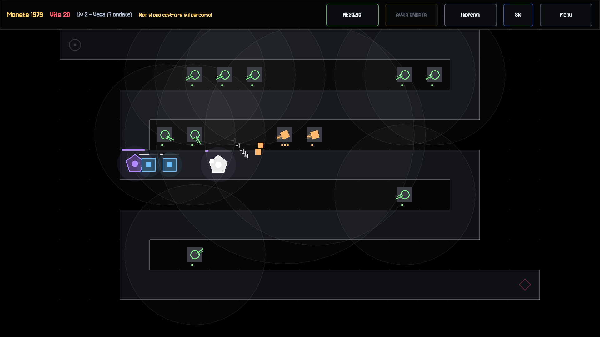
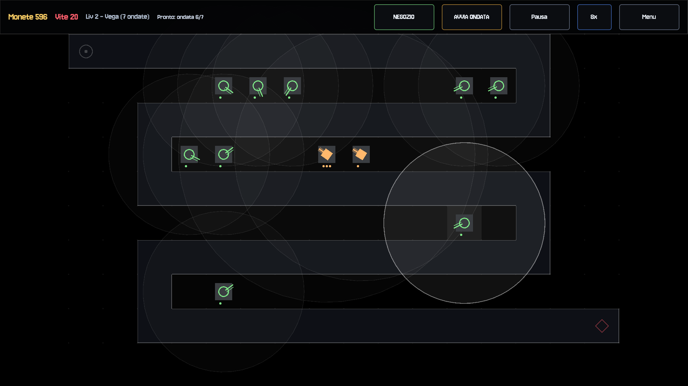
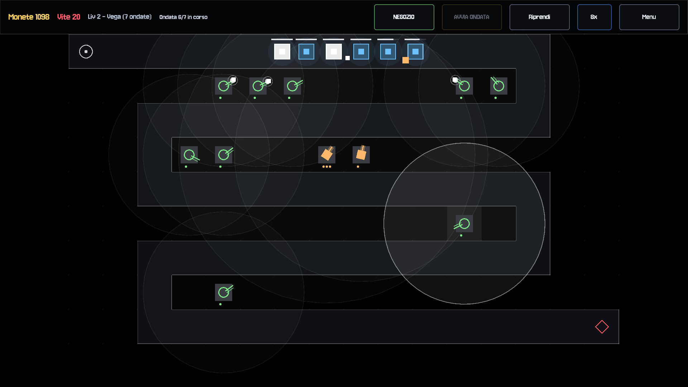
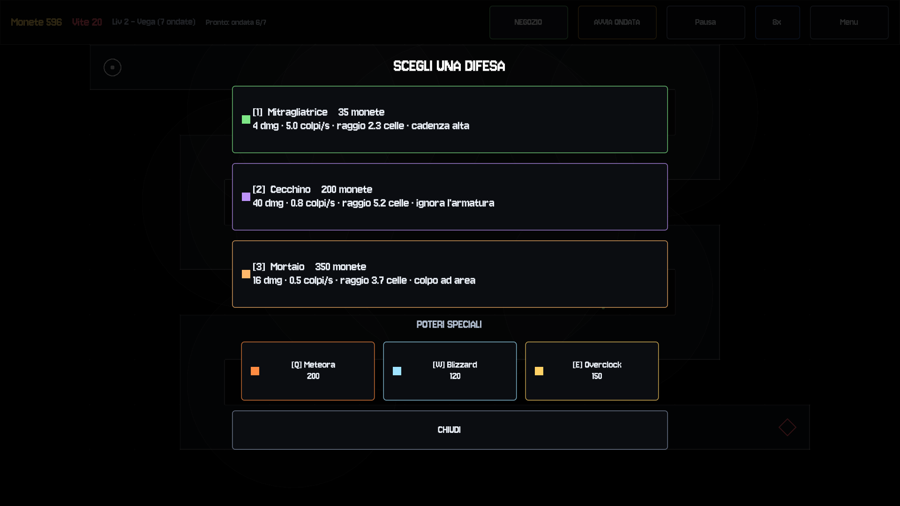
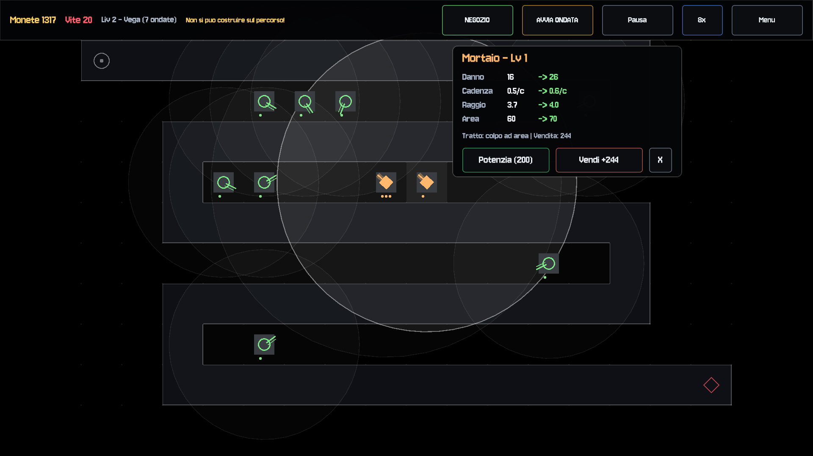

# Tower Defense

<p align="center">
  
</p>

A 2D pixel-art tower defense prototype set across five Italian-inspired locations. Build and upgrade towers, repel enemy waves, and use special powers at the right time.

> [!WARNING]
> This is an experimental prototype, not a finished game. Gameplay balance, visuals, content, and platform support are still in progress.

## Screenshots

<p align="center">
  
  
</p>
<p align="center">
  
  
</p>
<p align="center">
  
</p>

## Features

- Five levels: Rome, Venice, Milan, Palermo, and Etna.
- Three tower types with upgrades.
- Enemy archetypes, bosses, and an endless mode.
- Special powers, effects, sound effects, and procedural chiptune music.
- Mouse and touch-friendly controls.

## Run locally

This project requires **Godot 4.7** or a compatible version.

1. Import the project folder in the Godot Project Manager.
2. Open it and press `F6`/`F5`, or run:

   ```sh
   godot --path .
   ```

`TowerDefense.exe` is also included for Windows.

## Build the RHEL package

The `packaging/` directory contains the RPM setup (spec file, desktop entry, and build script).
On a RHEL system (or container) with `rpm-build` and Godot 4.x (with Linux/X11 export templates) installed:

```sh
./packaging/build-rpm.sh
```

The resulting `.rpm` is written under `build/rpmbuild/RPMS/`. Set `GODOT=/path/to/godot` if the binary is not in `PATH`.


## Development and testing

The pixel-art assets can be regenerated with the scripts in `tools/` (Python and Pillow required). Verification scripts are in `tests/` and can be run with a locally configured Godot test runner.

## License and notices

The original code and assets in this repository are licensed under the [MIT License](LICENSE). The bundled Jersey 10 font remains separately licensed under the [SIL Open Font License 1.1](THIRD_PARTY_NOTICES.md). See [THIRD_PARTY_NOTICES.md](THIRD_PARTY_NOTICES.md) for full third-party notices.
